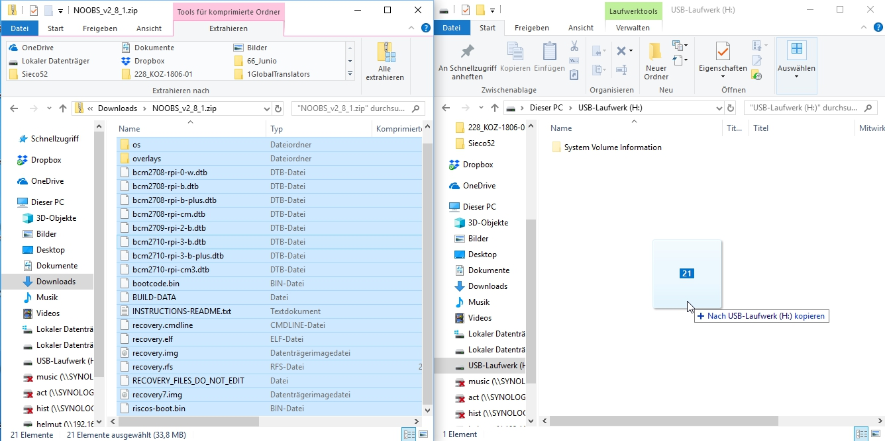

### Herunterladen von NOOBS

Die Verwendung von NOOBS ist der einfachste Weg, um Raspbian auf Ihrer SD-Karte zu installieren. Um eine Kopie von NOOBS zu bekommen:

+ Besuchen Sie [www.raspberrypi.org/downloads/](https://www.raspberrypi.org/downloads/)

+ Sie sollten eine Box mit einem Link zu den NOOBS-Dateien sehen. Klick auf den Link.

+ Am einfachsten ist es, das Zip-Archiv der Dateien herunterzuladen.

### Formatieren der SD-Karte

Wenn auf der SD-Karte, auf der Sie Raspbian installieren möchten, derzeit eine ältere Version von Raspbian installiert ist, möchten Sie möglicherweise zuerst die Dateien von der Karte sichern, da sie während dieses Vorgangs überschrieben werden.

+ Besuchen Sie die Website der SD Association und laden Sie [SD Formatter 4.0](https://www.sdcard.org/downloads/formatter_4/index.html) für Windows oder Mac herunter.

+ Folgen Sie den Anweisungen, um die Software zu installieren.

+ Legen Sie Ihre SD-Karte in den SD-Kartenleser des Computers oder Laptops ein und notieren Sie sich den Laufwerksbuchstaben, z. B. `F: /`.

+ Wählen Sie in SD Formatter den Laufwerksbuchstaben für Ihre SD-Karte und formatieren Sie sie.

### Extrahieren von NOOBS aus dem Zip-Archiv

Als nächstes müssen Sie die Dateien aus dem NOOBS-ZIP-Archiv extrahieren, das Sie von der Raspberry Pi-Website heruntergeladen haben.

+ Gehen Sie zu Ihrem Ordner " *Downloads* " und suchen Sie die heruntergeladene ZIP-Datei.

+ Extrahieren Sie die Dateien und halten Sie das resultierende Explorer / Finder-Fenster geöffnet.

### Kopieren der Dateien

+ Öffnen Sie nun ein anderes Explorer / Finder-Fenster und navigieren Sie zur SD-Karte. Am besten positionieren Sie die beiden Fenster nebeneinander.

+ Wählen Sie alle Dateien aus dem Ordner *NOOBS* und ziehen Sie sie auf die SD-Karte.

+ Werfen Sie die SD-Karte aus.

### Booten von NOOBS

+ Sobald die Dateien kopiert wurden, legen Sie die microSD-Karte in Ihren Raspberry Pi ein und stecken Sie den Pi in eine Stromquelle.

+ Ihnen wird eine Auswahl angeboten, wenn das Installationsprogramm geladen wurde. Sie sollten das Kontrollkästchen für **Raspbian**aktivieren und dann auf **Installieren**klicken.

+ Klicken Sie im Warndialog auf **Ja** , und lehnen Sie sich zurück und entspannen Sie sich. Es wird eine Weile dauern, aber Raspbian wird installiert.

+ Wenn Raspbian installiert wurde, klicken Sie auf **OK** und Ihr Raspberry Pi wird neu gestartet und Raspbian wird dann hochfahren.

