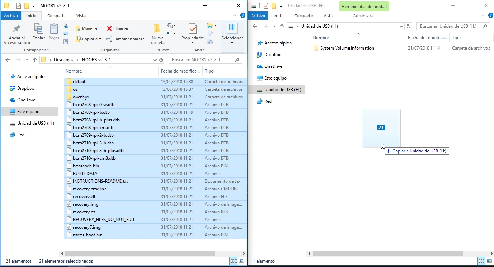

### Descargar NOOBS

Usar NOOBS es la forma más fácil de instalar Raspbian en tu tarjeta SD. Para obtener una copia de NOOBS:

+ Visita [www.raspberrypi.org/downloads/](https://www.raspberrypi.org/downloads/)

+ Deberías ver un cuadro con un enlace a los archivos de NOOBS. Haz clic en el enlace.

+ La opción más simple es descargar el archivo zip correspondiente.

### Formatear la tarjeta SD

Si la tarjeta SD en la que deseas instalar Raspbian ya tiene una versión anterior de Raspbian, es recomendable que primero hagas una copia de seguridad de los archivos de la tarjeta, ya que se sobreescribirán durante este proceso.

+ Visita el sitio web de la SD Association (Asociación SD) y descarga el programa [SD Memory Card Formatter (la última versión)](https://www.sdcard.org/downloads/formatter_4/index.html) para Windows o Mac.

+ Sigue las instrucciones para instalar el software.

+ Inserta la tarjeta SD en el lector de tarjetas SD de tu ordenador u ordenador portátil y anota la letra de unidad que le ha sido asignada, por ejemplo `F:/`.

+ En SD Formatter, selecciona la letra de unidad de tu tarjeta SD y formatéala.

### Extraer NOOBS del archivo zip

A continuación, deberás extraer los archivos que hay en el fichero zip de NOOBS que descargaste de la web de Raspberry Pi.

+ Abre tu carpeta de *Descargas* y busca el archivo zip que has descargado.

+ Extrae los archivos y mantén abierta la ventana resultante del Explorador / Finder.

### Copiar los archivos

+ Ahora abre otra ventana del Explorador / Finder y navega a la tarjeta SD. Lo mejor es colocar las dos ventanas una al lado de la otra.

+ Selecciona todos los archivos de la carpeta *NOOBS* y arrástralos a la tarjeta SD.

+ Expulsa la tarjeta SD.

### Arrancar con NOOBS

+ Una vez que se hayan copiado los archivos, inserta la tarjeta microSD en tu Raspberry Pi, y conecta el Pi a una fuente de alimentación.

+ Cuando el instalador se haya cargado, se te ofrecerá elegir una opción. Debes marcar la casilla para **Raspbian**, y luego hacer clic en **Install** (Instalar).

+ Haz clic en **Yes** cuando aparezca el diálogo de advertencia, siéntate cómodamente y relájate. La instalación tardará un buen rato, pero Raspbian se instalará.

+ Cuando se haya acabado de instalar Raspbian, haz clic en **OK** para que tu Raspberry Pi se reinicie y arranque con Raspbian.

