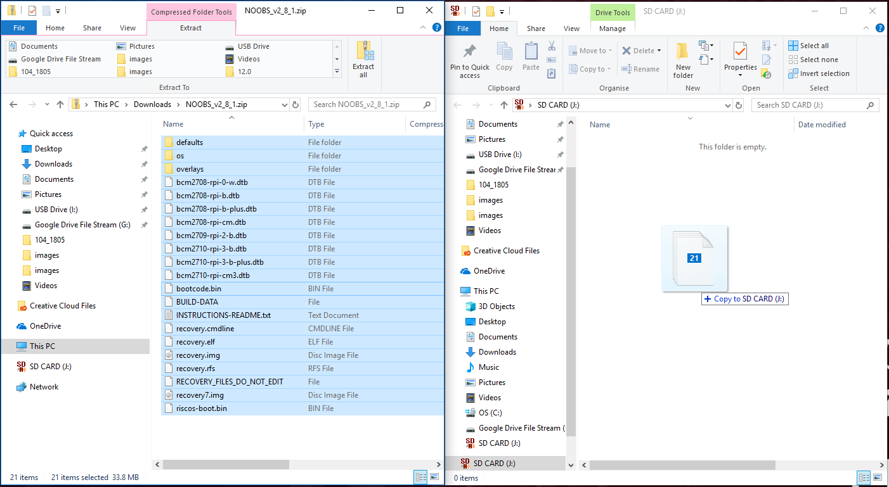

### Téléchargement de NOOBS

Utiliser NOOBS est le moyen le plus simple d'installer Raspbian sur votre carte SD. Pour obtenir une copie de NOOBS:

+ Visitez [www.raspberrypi.org/downloads/](https://www.raspberrypi.org/downloads/)

+ Vous devriez voir une boîte avec un lien vers les fichiers NOOBS. Clique sur le lien.

+ L'option la plus simple consiste à télécharger l'archive zip des fichiers.

### Formatage de la carte SD

Si la carte SD sur laquelle vous souhaitez installer Raspbian a actuellement une ancienne version de Raspbian, vous pouvez d'abord sauvegarder les fichiers de la carte, car ils seront écrasés au cours de ce processus.

+ Visitez le site Web de l'association SD et téléchargez [SD Formatter 4.0](https://www.sdcard.org/downloads/formatter_4/index.html) pour Windows ou Mac.

+ Suivez les instructions pour installer le logiciel.

+ Insérez votre carte SD dans le lecteur de carte SD de l'ordinateur ou de l'ordinateur portable et notez la lettre de lecteur qui lui est attribuée, par exemple `F: /`.

+ Dans SD Formatter, sélectionnez la lettre de lecteur de votre carte SD et formatez-la.

### Extraire NOOBS de l'archive zip

Ensuite, vous devrez extraire les fichiers de l'archive zip NOOBS que vous avez téléchargée sur le site Web de Raspberry Pi.

+ Allez dans votre dossier *Downloads* et trouvez le fichier zip que vous avez téléchargé.

+ Extrayez les fichiers et laissez la fenêtre Explorateur / Finder ouverte.

### Copier les fichiers

+ Maintenant, ouvrez une autre fenêtre Explorer / Finder et naviguez jusqu'à la carte SD. Il est préférable de positionner les deux fenêtres côte à côte.

+ Sélectionnez tous les fichiers du dossier *NOOBS* et faites-les glisser sur la carte SD.

+ Éjectez la carte SD.

### Démarrer depuis NOOBS

+ Une fois les fichiers copiés, insérez la carte micro SD dans votre Raspberry Pi et branchez le Pi dans une source d'alimentation.

+ Vous aurez le choix lorsque le programme d'installation sera chargé. Vous devez cocher la case **Raspbian**, puis cliquer sur **Install**.

+ Cliquez sur **Oui** dans la boîte de dialogue d'avertissement, puis asseyez-vous et détendez-vous. Cela prendra du temps, mais Raspbian va installer.

+ Lorsque Raspbian a été installé, cliquez sur **OK** et votre Raspberry Pi redémarrera et Raspbian démarrera.

