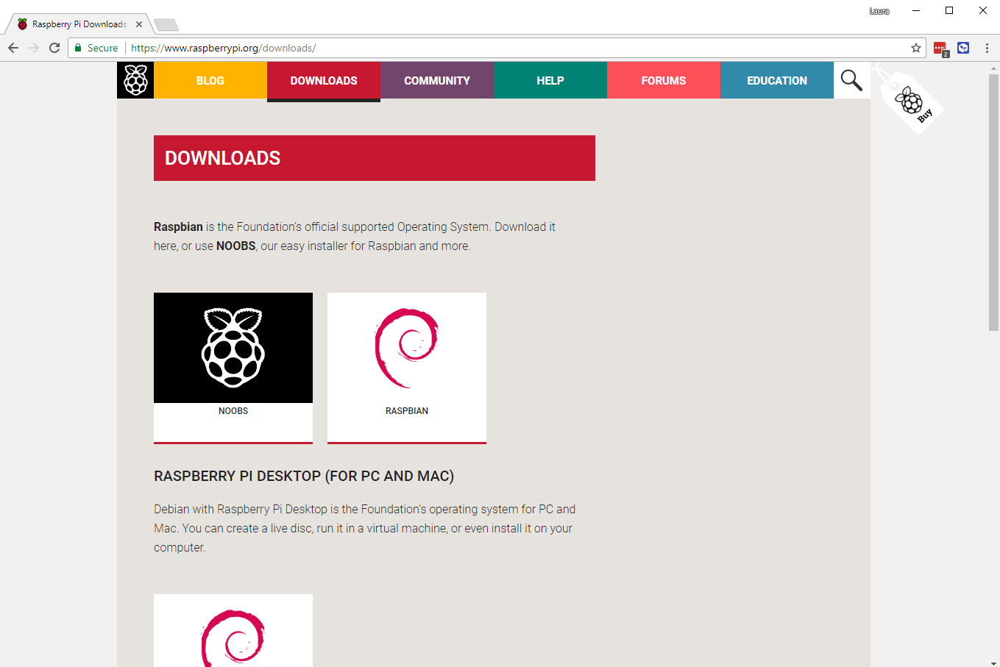

### Téléchargement de NOOBS

Utiliser NOOBS est le moyen le plus simple d'installer Raspbian sur ta carte SD. Pour obtenir une copie de NOOBS:

+ Rends-toi sur [www.raspberrypi.org/downloads/](https://www.raspberrypi.org/downloads/)

+ Tu devrais voir un lien avec un lien vers les fichiers NOOBS. Clique sur le lien.

+ L'option la plus simple consiste à télécharger l'archive zip des fichiers.

### Formatage de la carte SD

Si la carte SD sur laquelle tu souhaites installer Raspbian a actuellement une ancienne version de Raspbian, tu peux d'abord sauvegarder les fichiers de la carte, car ils seront écrasés au cours de ce processus.

+ Visite le site Web de l'association SD et télécharge [SD Formatter 4.0](https://www.sdcard.org/downloads/formatter_4/index.html) pour Windows ou Mac.

+ Suis les instructions pour installer le logiciel.

+ Insère ta carte SD dans le lecteur de carte SD de l'ordinateur et note la lettre de lecteur qui lui est attribuée, par exemple `F: /`.

+ Dans SD Formatter, sélectionne la lettre de lecteur de votre carte SD et formate-la.

### Extraire NOOBS de l'archive zip

Ensuite, tu devras extraire les fichiers de l'archive zip NOOBS que tu as téléchargée sur le site Web de Raspberry Pi.

+ Va dans ton dossier *Téléchargements* et trouve le fichier zip que tu as téléchargé.

+ Extrais les fichiers et laisse la fenêtre Explorateur / Finder ouverte.

### Copier les fichiers

+ Maintenant, ouvre une autre fenêtre Explorer / Finder et navigue jusqu'à la carte SD. Il est préférable de positionner les deux fenêtres côte à côte.

+ Sélectionne tous les fichiers du dossier *NOOBS* et fais-les glisser dans la carte SD.

+ Éjecte la carte SD.

### Démarrer depuis NOOBS

+ Une fois les fichiers copiés, insère la carte micro SD dans ton Raspberry Pi et branche le Pi à une source d'alimentation.

+ Tu auras le choix lorsque le programme d'installation sera chargé. Tu devras cocher la case **Raspbian**, puis cliquer sur **Install**.

+ Clique sur **Yes** dans la boîte de dialogue d'avertissement, puis assieds-toi et détends-toi. Cela prendra du temps, mais Raspbian va s'installer.

+ Lorsque Raspbian a été installé, clique sur **OK** et ton Raspberry Pi redémarrera avec Raspbian.

