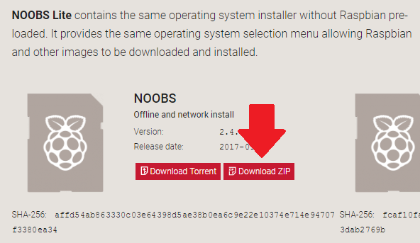

### Mengunduh NOOBS

Menggunakan NOOBS adalah cara termudah untuk menginstal Raspbian pada kartu SD Anda. Untuk mendapatkan salinan NOOBS:

+ Kunjungi [www.raspberrypi.org/downloads/](https://www.raspberrypi.org/downloads/)

+ Anda akan melihat kotak dengan tautan ke file NOOBS. Klik pada link.

+ Opsi paling sederhana adalah mengunduh arsip zip file.

### Memformat Kartu SD

Jika kartu SD yang Anda inginkan untuk menginstal Raspbian saat ini memiliki versi Raspbian yang lebih lama di atasnya, Anda mungkin ingin mencadangkan file dari kartu terlebih dahulu, karena kartu tersebut akan ditimpa selama proses ini.

+ Kunjungi situs web SD Association dan unduh [SD Formatter 4.0](https://www.sdcard.org/downloads/formatter_4/index.html) untuk Windows atau Mac.

+ Ikuti instruksi untuk menginstal perangkat lunak.

+ Masukkan kartu SD Anda ke komputer atau pembaca kartu SD laptop dan catat huruf drive yang dialokasikan padanya, misalnya `F: /`.

+ Di dalam SD Formatter, pilih huruf drive untuk kartu SD Anda, dan formatlah.

### Mengekstrak NOOBS dari arsip zip

Selanjutnya, Anda perlu mengekstrak file dari arsip zip NOOBS yang Anda unduh dari situs web Raspberry Pi.

+ Buka folder *Downloads* dan temukan file zip yang Anda unduh.

+ Ekstrak file dan biarkan jendela Explorer / Finder terbuka.

### Menyalin file

+ Sekarang buka jendela Explorer / Finder lain dan arahkan ke kartu SD. Yang terbaik adalah memposisikan dua jendela berdampingan.

+ Pilih semua file dari folder *NOOBS* dan seret ke kartu SD.

+ Keluarkan kartu SD.

### Booting dari NOOBS

+ Setelah file-file tersebut disalin, masukkan Micro SD Card ke Raspberry Pi Anda, dan tancapkan Pi ke sumber daya.

+ Anda akan ditawari pilihan ketika installer telah dimuat. Anda harus mencentang kotak untuk **Raspbian**, lalu klik **Pasang**.

+ Klik **Ya** pada dialog peringatan, lalu duduk dan rileks. Ini akan memakan waktu cukup lama, tetapi Raspbian akan menginstal.

+ Ketika Raspbian telah diinstal, klik **OK** dan Raspberry Pi Anda akan restart dan Raspbian akan boot.

